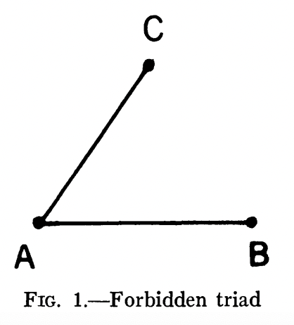

# The Strength of weak ties, Mark S.Granovetter

## Abstract
Small&well-defined and primary groups are having strong ties.  
Strong ties vary with correlation of their network.  
Weak ties can illustrate about relations between groups and segments of social structure not easily defined.
<!-- 1차집단(가족,친한 친구)같은 작고 경계가 뚜렷한 집단들은 강한 유대를 가진다.
강한 유대와 서로 간의 네트워크의 겹침정도는 비례한다.
약한 유대는 집단 간의 관계와 일반적으로 분석되는 강한 유대의 관계들로는 설명되지 않는 사회의 단면을 보여준다. -->
<!-- vary -> 비례하다
primary groups -> 1차 집단 -->
### First
We have insights about macro situation and ideas about micro situations, but we don't understand macro-micro interaction
<!-- 우리는 거시적 현상에 대한 통찰력도 미시적 현상에 대한 아이디어들도 있지만 소집단 즉 미시의 상호작용이 어떻게 대규모 패턴 즉 거시에 영향을 미치는지에 대해서는 파악하지 못하고 있다. -->

*What is Qualitative study?*
*What is the difference betwenn Large-scale statistical study and former one?*
<!-- 우리는 거시적 현상에 대한 통찰력도 미시적 현상에 대한 아이디어들도 있지만 소집단 즉 미시의 상호작용이 어떻게 대규모 패턴 즉 거시에 영향을 미치는지에 대해서는 파악하지 못하고 있다. -->
*What is Qualitative study? what is the difference betwenn Large-scale statistical study and former one?*

### Second
Limits of current Sociometry
<!-- 기존 소시오메트리의 한계 -->
### Third
Because of technical complexity of structual issues, we choose the strategy focusing on "Strength of interpersonal ties". We focus relation between "Strength of ties" and macro phenomean. Even if our studies are qualitative but it's relate to mathmatical models.  
<!-- 구조적 이슈를 상세하게 다루는 연구들은 기술적 복잡성 때문에 우리는 이 논문에서 "유대의 강도"에 집중하는 전략 취함. "유대의 강도"와 거시적 현상과의 연관성에 집중하고 기본적으로 질적(비수리적)이지만 모델링의 가능성 있음 -->
## The Strength of Ties
<!-- 시간, 정서적 강도, 친밀감, 상호 서비스라는 4가지 요소로 유대감의 정도는 판별될 수 있다.
연구에서는 명확히 수치적으로 계산하진 않고 직관적으로 유대가 강한지, 약한지, 없는지 정도만 사용할 것이다. -->
Four elements. 
*How do we consider that four elements these days?*. 

<!-- 시간, 정서적 강도, 친밀감, 상호 서비스라는 4가지 요소로 유대감의 정도는 판별될 수 있다.
연구에서는 명확히 수치적으로 계산하진 않고 직관적으로 유대가 강한지, 약한지, 없는지 정도만 사용할 것이다. -->
*How do we consider that four elements these days?*
*EX. SNS, Messages frequency, community*

> ### Meaning of "Absent" and Overlap Hypothesis
*Absent* not only means no connenction but also means 'negligible' connection like newspaper shop owner and buyer.  
*Overlap Hypothesis* assert the stronger tie of A and B, the larger the proportion of individuals in group S to whom they will both be tied.  
*We can apply these thesis in SNS friend.*

Relationship of A-B, A-C, B-C
1. (A-B)(A-C) == friend.
2. If A has strong ties with each other. Probablity of becoming friend of B and C is higher. 
3. A sim B and A sim C so B sim C == Birds of feather flock together
4. Peoples want to be friend with Friend of their friend by psycological strain.
*Does it mean Forbidden Triad?  

### **No strong tie is a bridge**
Bridge: line in a network which provides the only path between two points.   
If Ties of A-B, A-C are strong, then tie of B-C is likey to happen.  
Since A-B is not a bridge.  
It means **All bridges are weak ties**. 
but it happen rarely in large networks. But bridging function may be served locally. It means even if there are any other way to contact A-B and it's shortest path except A-B is called N, if N is over 2, we can call A-B as local bridge of degree N.  
**The more bigger N is, the more important that local bridge is**. 
Davis's suggestion: In interpersonal flow, probablity the flow of 'whatever', in these paragraphs especially information, is directly proportional to the number of all-positive paths connecting i and j and inversely proportional to the length of such paths.  
So removal of the weak tie is more damage to transmission probablities than strong tie. 
== When passed through weak tie 'whatever' could diffuse more larger people than strong tie.  

### A blindspot of existing studies
Sharply controlled investigation(like "Write your five closest friends") ignored weak ties. Or just recorded as a choice of frequency.  
So individuals classificate as a "Central" and "marginal".

### How does the marginal spread the innovation
Some studies comment Marginal as "underconform to norms". So they accept an innovation more easily than Central who are more care about safe.  
*If an innovation is safe, Central also adopt an innovation fastly.  
In this study, writer argue marginal is best place for defusing innovation because marginal have many weak ties as local bridges.

### WEAK TIES IN EGOCENTRIC NETWORKS
Unlike encapsulated people, acquaintances(=Weak ties) can give us new and innovative information came from far away.  
Local bridge==Source of novel information!=Strong ties==Deprived of information from distant parts ot the social system==provincial news and views of their close friend. 
==Disadvantage of labor market + Precluding them from wider aspects of culture and world view.  
So only weak ties can make him reach a wider world. 
**It means provincialism is also came from structure of network**
People's trong dense networks only posseses information already possesed by their ego.
### WEAK TIES AND COMMUNITY ORGANIZATION
Failure of community organization in the italian cohesive community of West end. 
Unless information is transmiited through personal ties, people don't believe and care it. And also people don't believe given leader without intermediary personal contacts.  
Importance of capacity to predict and affect their behavior about trust in leaders. It's also same as leader.